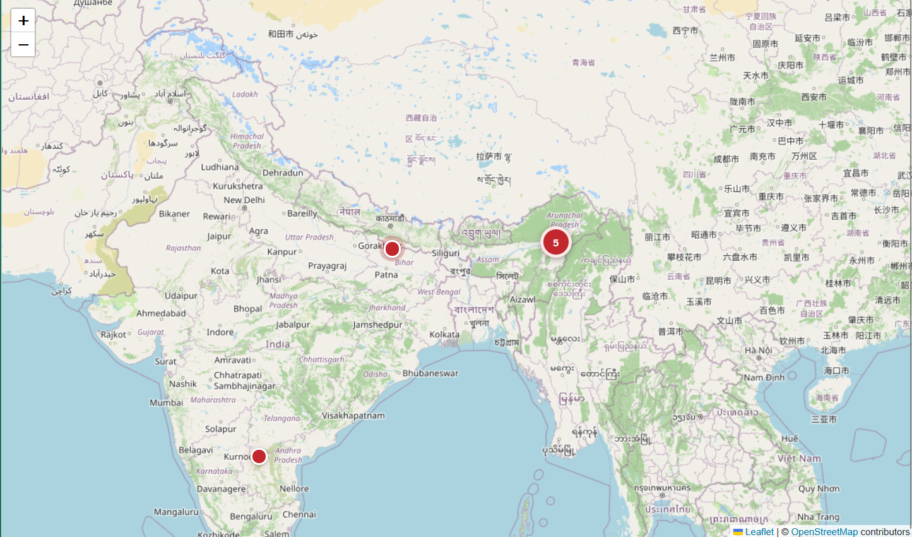
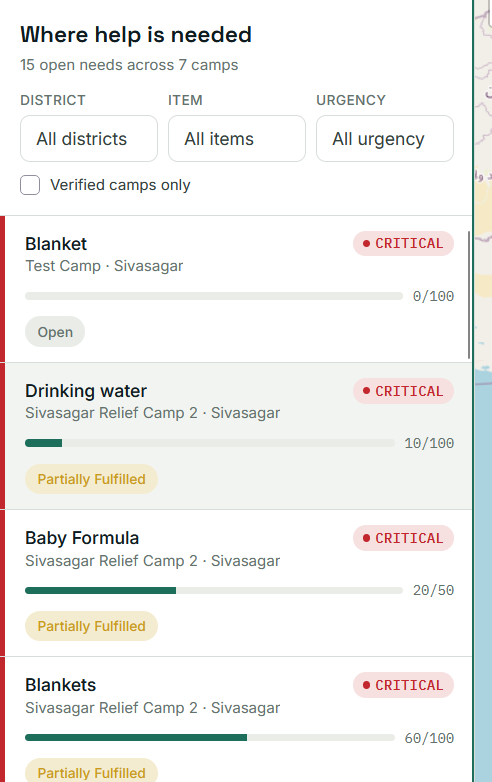
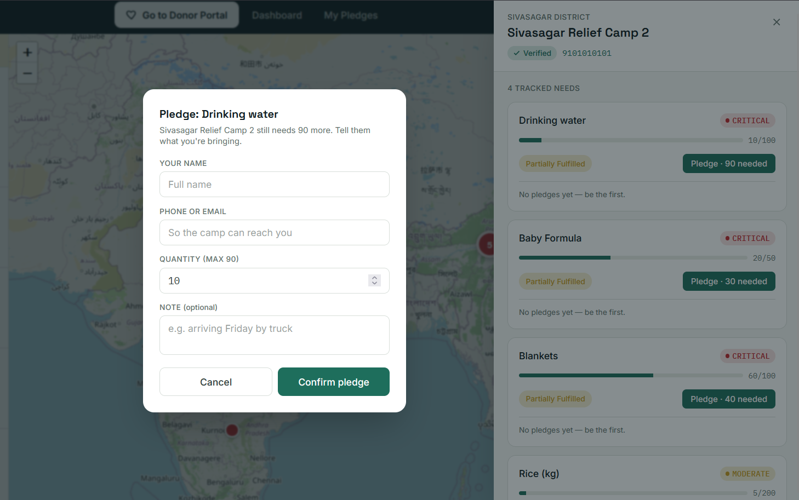

# ReliefLink — Donor Portal & Public Dashboard (Person 3)

Donor-facing map + claim flow, and the public stats dashboard, from the
disaster-relief camp coordination project. Built standalone so it can be
developed and demoed independently of Person 1 (Camp Coordinator Portal)
and Person 2 (Supabase backend), then wired together on integration day.

## Run it

```bash
npm install
npm run dev
```

Open the printed localhost URL. `/` is the Donor Map, `/dashboard` is the
Public Dashboard.

## Screenshots

### Donor Map (`/`)

Camps plotted on Leaflet, colored by their worst open need. Filters for
district, item and urgency. Click any marker to open the camp panel.



### Camp detail & claim (mobile)

The camp panel collapses to a bottom sheet on small screens, with a
**Claim** button per need.



### Public Dashboard (`/dashboard`)

Live totals and charts, recomputed from the same data the map uses.



## Scripts

| Command           | What it does                    |
| ----------------- | ------------------------------- |
| `npm run dev`     | Vite dev server with HMR        |
| `npm run build`   | Production build to `dist/`     |
| `npm run preview` | Serve the production build      |
| `npm run lint`    | oxlint over the source          |

## What's here

- **Donor Map** (`/`) — Leaflet + OpenStreetMap map of camps, colored by
  their worst open need (red = Critical, orange = High, yellow = Moderate,
  pulsing marker for Critical). District / item / urgency filters. List
  view alongside the map (or as a mobile tab). Clicking a camp opens a
  detail panel with every tracked need and a **Claim** button per need.
- **Claim Modal** — name, contact, quantity, submits the claim and updates
  `quantityFulfilled` / `status` immediately across the whole app (list,
  map marker color, and dashboard all react).
- **Public Dashboard** (`/dashboard`) — total camps, total needs, open
  needs, fulfilled %, an urgency breakdown chart, a needs-by-district
  chart, and an overall progress bar.

## How this plugs into Person 2's Supabase backend

Every component calls functions in `src/services/dataService.js` — never
mock data directly. That file currently reads/writes an in-memory copy of
`src/data/mockData.js`, shaped exactly like the shared **Camp / Need /
Claim** schema from the project plan.

To connect the real backend:

1. Fill in `src/lib/supabaseClient.js` with Person 2's Supabase URL/anon
   key (instructions are in that file).
2. In `src/services/dataService.js`, each function already has a
   commented-out Supabase version directly below it (`getCamps`,
   `getNeeds`, `getCampsWithNeeds`, `getDashboardStats`, `submitClaim`).
   Swap the mock body for the real query — the function signature and
   return shape stay the same, so no UI component needs to change.
3. Replace the mock pub/sub in `subscribeToChanges` with a real Supabase
   realtime channel (sketch included at the bottom of the file). The
   `useLiveCampsWithNeeds` / `useLiveDashboardStats` hooks already call
   `subscribeToChanges`, so real-time updates will flow through
   automatically once that swap is made.

No component, page, or chart imports Supabase or the mock data directly —
`dataService.js` is the only seam that needs to change.

## Stack

React + Vite, Tailwind CSS v4, React Router, Leaflet / react-leaflet,
Recharts, `@supabase/supabase-js` (installed, not yet wired up).

## Structure

```
src/
  components/    UI pieces (map, list, filters, badges, charts, modal)
  pages/         DonorPage, DashboardPage
  hooks/         useLiveCampsWithNeeds, useLiveDashboardStats
  services/      dataService.js — the backend seam
  data/          mockData.js — Camp/Need/Claim mock dataset
  lib/           supabaseClient.js — stub for Person 2's credentials
docs/
  screenshots/   images used in this README
```
